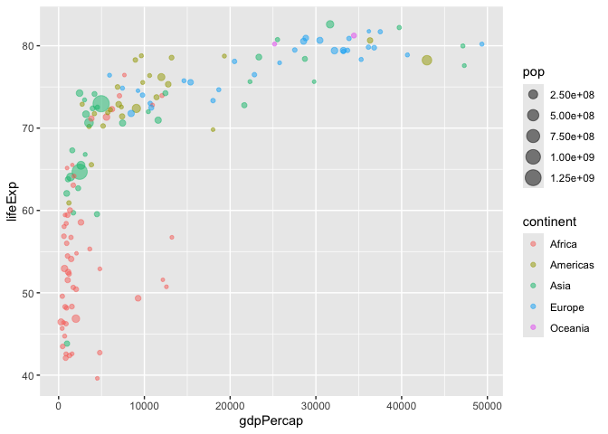
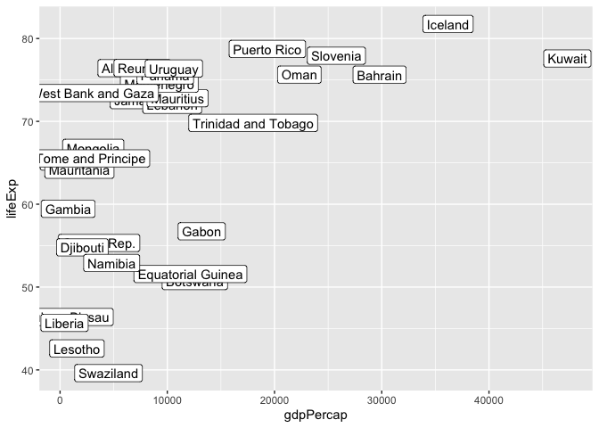

# Class 5: Data VIz with ggplot
Barry (PID: 911)

## Plotting in R

R has lot’s of ways to make plots and figures. This includes so-called
**base** graphics and packages like **ggplot2**

``` r
plot(cars)
```


This is a **base** R plot of the in-built `cars` dataset that has only
two columns:

``` r
head(cars)
```

      speed dist
    1     4    2
    2     4   10
    3     7    4
    4     7   22
    5     8   16
    6     9   10

> Q. How would we plot this wee dataset with **ggplot2**?

All ggplot figures have at least 3 layers:

- **data**
- **aes**thitics (how the data map to the plot)
- **geoms** (how we draw the plot, lines, points, etc.)

Before I use any new package I need to download and install it with the
`install.packages()` command.

I never use `install.packages()` within my quarto document otherwise I
will install the package over and over and over again - which is silly!

Once a package is installed I can load it up with the `library()`
function.

``` r
# install.packages("ggplot2")
library(ggplot2)

ggplot(cars) +
  aes(x=speed, y=dist) +
  geom_point()
```


**Key-point**: For simple plots (like the one above) ggplot is more
verbose (we need to do more typing) but as plots get more complicated
ggplot starts to be more clear and simple than base R plot()

## Section 6: Creating Scatter plots

``` r
p <- ggplot(cars) +
  aes(speed, dist) +
  geom_point() +
  geom_smooth(method = "lm", se = FALSE) +
  labs(title="Stopping distance of old cars",
       subtitle = "From the in-built cars dataset") +
  theme_bw()
```

``` r
p
```

    `geom_smooth()` using formula = 'y ~ x'


Put all your code and question answers in here:

> Q2. True or False? The ggplot2 package comes already installed with R?

FALSE

> Q3. Which plot types are typically NOT used to compare distributions
> of numeric variables?

> Q4.

### Gene expression scatter plot

Here we will cover how to:

- Adjust the point size of a scatter plot using the size parameter.
- Change the point color of a scatter plot using the color parameter.
- Set a parameter alpha to change the transparency of all points.

``` r
url <- "https://bioboot.github.io/bimm143_S20/class-material/up_down_expression.txt"
genes <- read.delim(url)
head(genes)
```

            Gene Condition1 Condition2      State
    1      A4GNT -3.6808610 -3.4401355 unchanging
    2       AAAS  4.5479580  4.3864126 unchanging
    3      AASDH  3.7190695  3.4787276 unchanging
    4       AATF  5.0784720  5.0151916 unchanging
    5       AATK  0.4711421  0.5598642 unchanging
    6 AB015752.4 -3.6808610 -3.5921390 unchanging

> Q. Use the nrow() function to find out how many genes are in this
> dataset. What is your answer?

``` r
nrow(genes)
```

    [1] 5196

> Q. Use the colnames() function and the ncol() function on the genes
> data frame to find out what the column names are (we will need these
> later) and how many columns there are. How many columns did you find?

``` r
ncol(genes)
```

    [1] 4

``` r
dim(genes)
```

    [1] 5196    4

> Q. Use the table() function on the State column of this data.frame to
> find out how many ‘up’ regulated genes there are. What is your answer?

``` r
table(genes$State)
```


          down unchanging         up 
            72       4997        127 

> Q. Using your values above and 2 significant figures. What fraction of
> total genes is up-regulated in this dataset?

``` r
round( table(genes$State)/nrow(genes), 2)
```


          down unchanging         up 
          0.01       0.96       0.02 

The key functions here where:

`nrow()` and `ncol()` `table()` is very useful for getting counts
finally `round()`

A first plot:

``` r
ggplot(genes) +
  aes(Condition1, Condition2) +
  geom_point( alpha=0.2)
```


``` r
p <- ggplot(genes) +
        aes(Condition1, Condition2, col=State) +
        geom_point()
  
p
```


Change the color scale so unchanging genes are not so obvious as I want
to highlight the Up and Down genes.

``` r
p + theme_bw() +
  scale_colour_manual( values=c("blue","gray","red") )
```


## 7. Going Further

The gapminder dataset contains economic and demographic data about
various countries since 1952. This dataset features in your DataCamp
course for this week

``` r
# File location online
url <- "https://raw.githubusercontent.com/jennybc/gapminder/master/inst/extdata/gapminder.tsv"

gapminder <- read.delim(url)
```

``` r
library(dplyr)
```


    Attaching package: 'dplyr'

    The following objects are masked from 'package:stats':

        filter, lag

    The following objects are masked from 'package:base':

        intersect, setdiff, setequal, union

``` r
gapminder_2007 <- filter(gapminder, year==2007)
```

> Q. Complete the code below to produce a first basic scater plot of
> this gapminder_2007 dataset:

``` r
ggplot(gapminder_2007) +
  aes(x=gdpPercap, y=lifeExp, 
      size=pop, col=continent) +
  geom_point(alpha=0.5)
```



Include multiple years

``` r
gap <-  filter(gapminder, 
               year==1957 | year==2007)
```

How many entries for each year

``` r
table(gap$year)
```


    1957 2007 
     142  142 

How many entries per country?

``` r
table(gap$country)
```


                 Afghanistan                  Albania                  Algeria 
                           2                        2                        2 
                      Angola                Argentina                Australia 
                           2                        2                        2 
                     Austria                  Bahrain               Bangladesh 
                           2                        2                        2 
                     Belgium                    Benin                  Bolivia 
                           2                        2                        2 
      Bosnia and Herzegovina                 Botswana                   Brazil 
                           2                        2                        2 
                    Bulgaria             Burkina Faso                  Burundi 
                           2                        2                        2 
                    Cambodia                 Cameroon                   Canada 
                           2                        2                        2 
    Central African Republic                     Chad                    Chile 
                           2                        2                        2 
                       China                 Colombia                  Comoros 
                           2                        2                        2 
            Congo, Dem. Rep.              Congo, Rep.               Costa Rica 
                           2                        2                        2 
               Cote d'Ivoire                  Croatia                     Cuba 
                           2                        2                        2 
              Czech Republic                  Denmark                 Djibouti 
                           2                        2                        2 
          Dominican Republic                  Ecuador                    Egypt 
                           2                        2                        2 
                 El Salvador        Equatorial Guinea                  Eritrea 
                           2                        2                        2 
                    Ethiopia                  Finland                   France 
                           2                        2                        2 
                       Gabon                   Gambia                  Germany 
                           2                        2                        2 
                       Ghana                   Greece                Guatemala 
                           2                        2                        2 
                      Guinea            Guinea-Bissau                    Haiti 
                           2                        2                        2 
                    Honduras         Hong Kong, China                  Hungary 
                           2                        2                        2 
                     Iceland                    India                Indonesia 
                           2                        2                        2 
                        Iran                     Iraq                  Ireland 
                           2                        2                        2 
                      Israel                    Italy                  Jamaica 
                           2                        2                        2 
                       Japan                   Jordan                    Kenya 
                           2                        2                        2 
            Korea, Dem. Rep.              Korea, Rep.                   Kuwait 
                           2                        2                        2 
                     Lebanon                  Lesotho                  Liberia 
                           2                        2                        2 
                       Libya               Madagascar                   Malawi 
                           2                        2                        2 
                    Malaysia                     Mali               Mauritania 
                           2                        2                        2 
                   Mauritius                   Mexico                 Mongolia 
                           2                        2                        2 
                  Montenegro                  Morocco               Mozambique 
                           2                        2                        2 
                     Myanmar                  Namibia                    Nepal 
                           2                        2                        2 
                 Netherlands              New Zealand                Nicaragua 
                           2                        2                        2 
                       Niger                  Nigeria                   Norway 
                           2                        2                        2 
                        Oman                 Pakistan                   Panama 
                           2                        2                        2 
                    Paraguay                     Peru              Philippines 
                           2                        2                        2 
                      Poland                 Portugal              Puerto Rico 
                           2                        2                        2 
                     Reunion                  Romania                   Rwanda 
                           2                        2                        2 
       Sao Tome and Principe             Saudi Arabia                  Senegal 
                           2                        2                        2 
                      Serbia             Sierra Leone                Singapore 
                           2                        2                        2 
             Slovak Republic                 Slovenia                  Somalia 
                           2                        2                        2 
                South Africa                    Spain                Sri Lanka 
                           2                        2                        2 
                       Sudan                Swaziland                   Sweden 
                           2                        2                        2 
                 Switzerland                    Syria                   Taiwan 
                           2                        2                        2 
                    Tanzania                 Thailand                     Togo 
                           2                        2                        2 
         Trinidad and Tobago                  Tunisia                   Turkey 
                           2                        2                        2 
                      Uganda           United Kingdom            United States 
                           2                        2                        2 
                     Uruguay                Venezuela                  Vietnam 
                           2                        2                        2 
          West Bank and Gaza              Yemen, Rep.                   Zambia 
                           2                        2                        2 
                    Zimbabwe 
                           2 

``` r
table(gap$continent)
```


      Africa Americas     Asia   Europe  Oceania 
         104       50       66       60        4 

``` r
ggplot(gap) +
  aes(x=gdpPercap, y=lifeExp) +
  geom_point() +
  facet_wrap(~year)
```


How mnay years are in this dataset?

``` r
length(gapminder$year)
```

    [1] 1704

``` r
table(gapminder$year)
```


    1952 1957 1962 1967 1972 1977 1982 1987 1992 1997 2002 2007 
     142  142  142  142  142  142  142  142  142  142  142  142 

``` r
length( unique(gapminder$year) )
```

    [1] 12

``` r
library(dplyr)
```

> Q. Extract data for the US in 1992

``` r
filter(gapminder, country=="United States",
       year==1992)
```

            country continent year lifeExp       pop gdpPercap
    1 United States  Americas 1992   76.09 256894189  32003.93

What was the population of Ireland in the last year we have data for?

``` r
filter(gapminder, country=="Ireland", 
       year==2007)
```

      country continent year lifeExp     pop gdpPercap
    1 Ireland    Europe 2007  78.885 4109086     40676

> Q. What countries in data set had pop smaller than Ireland in 2007

- First limit/subset the dataset to the year 2007

``` r
gap07 <- filter(gapminder, year==2007)
```

- Then find the `pop` value for Ireland

``` r
ire_pop <- filter(gap07, country=="Ireland")["pop"]
ire_pop
```

          pop
    1 4109086

- Then extract all rows with `pop` less than Ireland’s

``` r
gap_small <- filter(gap07, pop < 4109086)
nrow(gap_small)
```

    [1] 31

``` r
ggplot(gap_small) +
  aes(gdpPercap, lifeExp, label=country) +
  geom_point() +
  geom_label()
```



``` r
library(ggrepel)

ggplot(gap_small) +
  aes(gdpPercap, lifeExp, label=country) +
  geom_point() +
  geom_label_repel()
```

    Warning: ggrepel: 2 unlabeled data points (too many overlaps). Consider
    increasing max.overlaps


